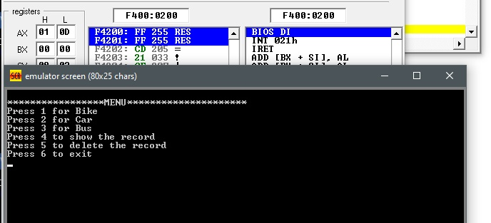
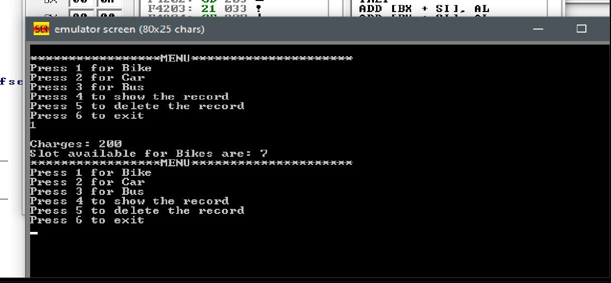
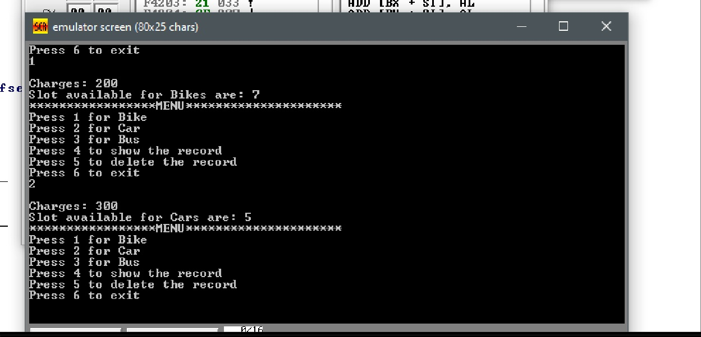
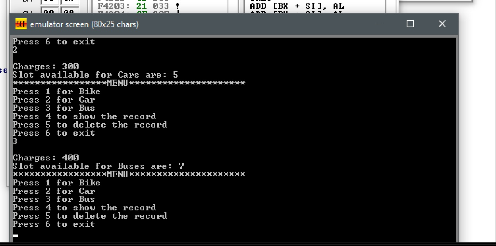
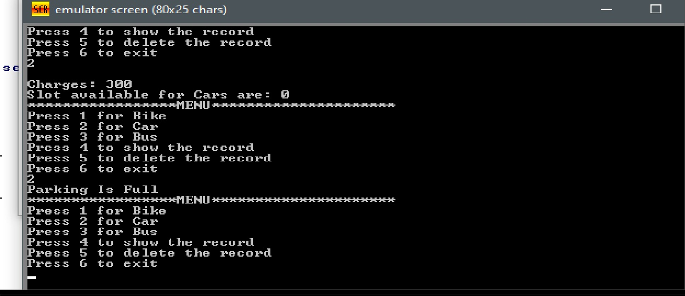
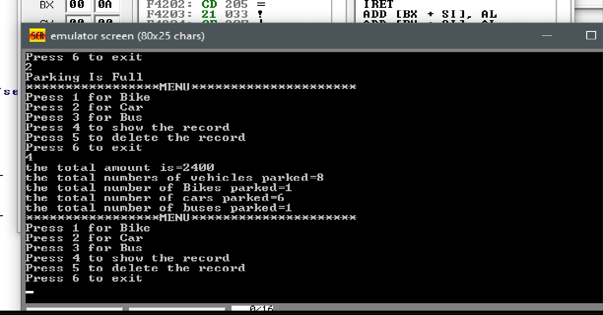
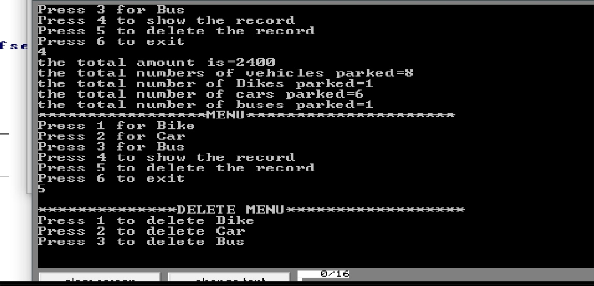
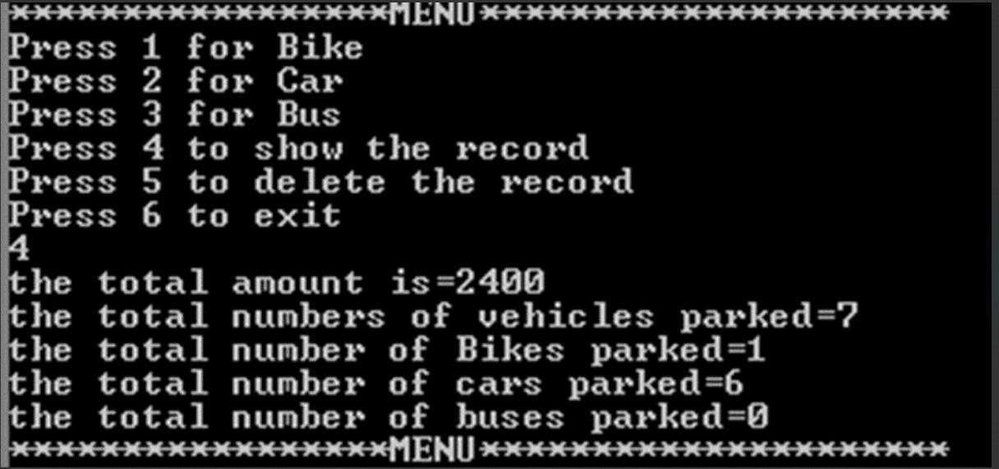
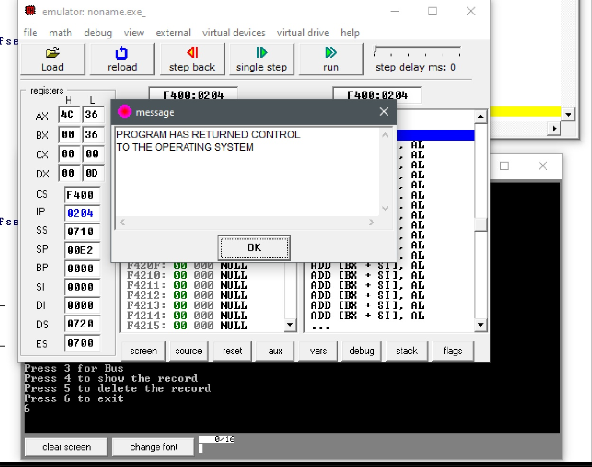

# 🚗 Smart Parking Management System — Assembly (Intel 8086)

<div align="center">


A fully featured, command-line **Smart Parking Management System** programmed in **16-bit Assembly Language (x86)** and designed to run on the **EMU8086** emulator. Developed as a 3rd Semester Computer Organization and Assembly Language (COAL) Lab project, the system automates vehicle parking logs, fee calculation, slot allocations, and record management without standard high-level language structures.

</div>

---

## 📸 Execution Screenshots

<table>
  <tr>
    <td align="center"><br/><b>🏠 Main Menu Selection</b></td>
    <td align="center"><br/><b>🏍️ Bike Entry & Slots Left</b></td>
    <td align="center"><br/><b>🚗 Car Entry & Slots Left</b></td>
  </tr>
  <tr>
    <td align="center"><br/><b>🚌 Bus Entry & Slots Left</b></td>
    <td align="center"><br/><b>🚫 Parking Full Alert</b></td>
    <td align="center"><br/><b>📊 Show Logged Records</b></td>
  </tr>
  <tr>
    <td align="center"><br/><b>🗑️ Delete Menu Selector</b></td>
    <td align="center"><br/><b>🧹 Record Deleted Successfully</b></td>
    <td align="center"><br/><b>🚪 Safe System Exit</b></td>
  </tr>
</table>

---

## ✨ Features

- **Multi-Vehicle Support** — Separate slots and fee calculations for:
  - **Bikes** (Charges: **200**, Max: **8 slots**)
  - **Cars** (Charges: **300**, Max: **6 slots**)
  - **Buses** (Charges: **400**, Max: **7 slots**)
- **Capacity Monitoring** — Overall capacity limit of **21 vehicles**. The system automatically halts registration and displays a `"Parking Is Full"` message when limits are reached.
- **Dynamic Slot Calculation** — Displays the remaining vacant slots in real-time as vehicles are registered.
- **Detailed Auditing & Records** — Displays:
  - Total earnings (automatically computed using 16-bit division and conversion routines)
  - Total number of parked vehicles
  - Breakdown by vehicle type (Bikes, Cars, Buses)
- **Record Deletion & Billing Adjustment** — Support for removing a vehicle (checkout), which frees up slots and deducts the appropriate vehicle fare from the total amount.
- **Data Validation** — Detects invalid inputs and prompts the user with a `"Wrong input"` alert.

---

## 🛠️ Tech Stack & Assembly Mechanics

- **Language** — 16-bit Assembly (x86 Intel)
- **Emulator** — EMU8086
- **Architecture** — Small Memory Model (`.model small`)
- **Stack** — 100h bytes (`.stack 100h`)

### 🧠 Assembly Concepts Applied

| Instruction / Concept | System Usage |
|---|---|
| **BIOS Interrupts** | `int 21h` (Functions `01h` for key inputs, `02h` for char output, `09h` for string output) |
| **Conditional Jumps** | `je`, `jne`, `jle`, `jl` for routing menu inputs and checking limits |
| **Integer Arithmetic** | `add`, `sub`, `dec` for tracking slot availability and ledger balance |
| **16-bit Division (`div`)** | Custom print loop that extracts decimal digits for the total billing amount |
| **Register Management** | Extensive use of `ax`, `bx`, `cx`, `dx` registers for stack operations and logic |
| **Procedures (`proc`)** | Modular code design using separate procedures for `bikee`, `caar`, `buss`, `delt`, and `recrd` |
| **Stack Operations** | `push` and `pop` used in numerical printing algorithms to reverse digit order |

---

## 📂 Project Structure

```
PARKING_MANAGEMENT_SYSTEM/
│
├── 📜 Final.ASM               — Complete Assembly source code
├── 📁 screenshots/            — Visual walkthrough of the terminal program execution
│   ├── main_menu.jpg
│   ├── bike_parking.jpg
│   ├── car_parking.jpg
│   ├── bus_parking.jpg
│   ├── parking_full.jpg
│   ├── show_records.jpg
│   ├── delete_menu.jpg
│   ├── delete_action.jpg
│   └── exit_screen.jpg
└── 📦 COAL LAB PROJECT.zip     — Packaged laboratory reports, project proposals, and presentations
```

---

## 🚀 Getting Started

### 1. Clone the Repository

```bash
git clone https://github.com/AnasQ2003/PARKING_MANAGEMENT_SYSTEM.git
cd PARKING_MANAGEMENT_SYSTEM
```

### 2. Run the Emulator

1. Download and install **EMU8086** (or use DOSBox with MASM/TASM).
2. Open **`Final.ASM`** in EMU8086.
3. Click the **Compile** button.
4. Click **Run** to execute the terminal interface.

### 3. Usage Flow

1. Enter `1`, `2`, or `3` to register incoming vehicles.
2. Enter `4` at any time to audit total parked vehicles, individual category totals, and financial registers.
3. Enter `5` to checkout a vehicle (releases slot and recalculates billing).
4. Enter `6` to exit the system.

---

## 📚 Academic Context

| Detail | Info |
|---|---|
| **University** | Bahria University, Karachi Campus |
| **Department** | Department of Computer Science |
| **Course** | Computer Organization & Assembly Language (CEL-324) |
| **Semester** | 3rd Semester |
| **Project Type** | COAL Lab Project |
| **Course Instructor** | Ma'am Aisha Danish |
| **Lab Engineer** | Ma'am Saba Naeem |
| **Group Members** | M. Mohib, Hassan Ali Naqvi, Anas Ahmed Qureshi |

---

## 🤝 Contributing

This is an academic project. Feel free to fork it, extend it, or use it as a reference for your own x86 Assembly projects.

---

## 👨‍💻 Author

**Anas Qayyum**
- GitHub: [@AnasQ2003](https://github.com/AnasQ2003)
